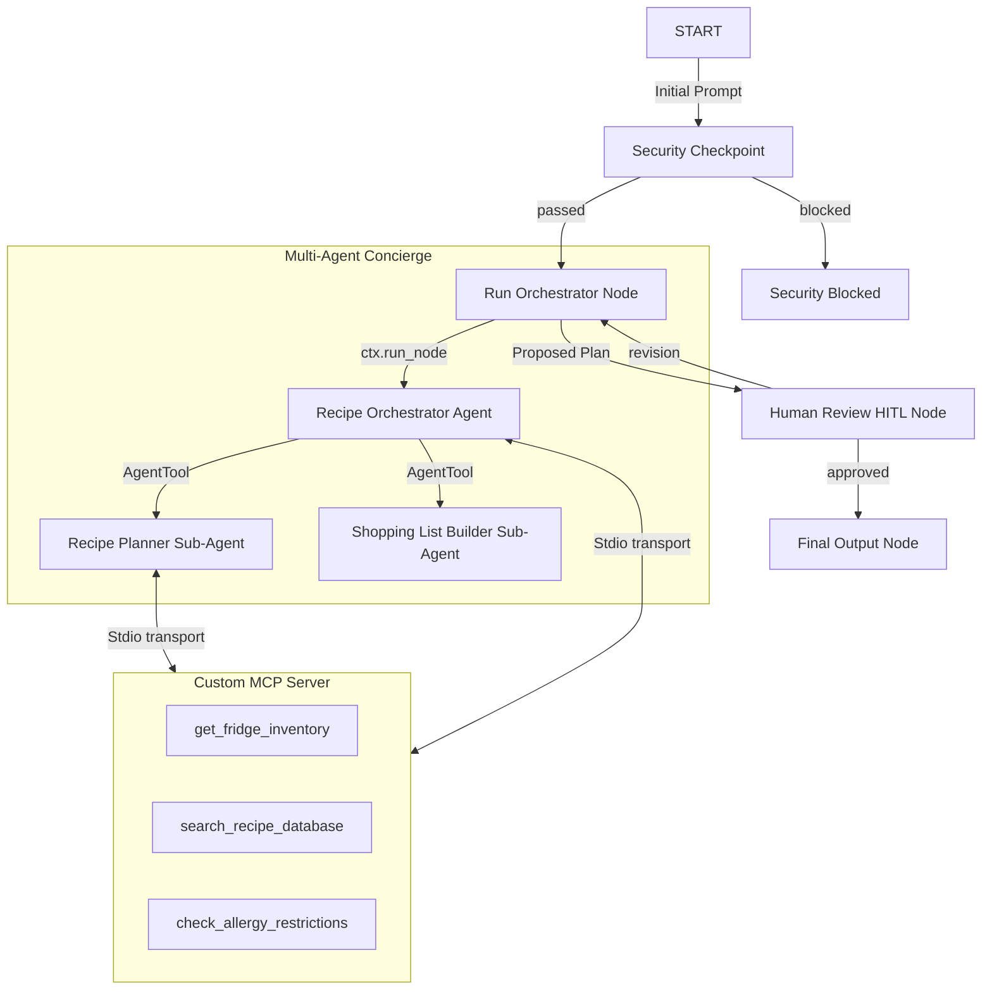

# 🍳 RecipeHelper Concierge Agent — Submission Write-Up

## 1. Problem Statement
Cooking healthy and customized meals at home is challenging due to the effort involved in recipe searching, allergy filtering, and building organized shopping lists. Users frequently struggle with:
- Finding recipes matching their immediate fridge/pantry inventory.
- Keeping track of complex allergy restrictions across different ingredients.
- The manual friction of translating menu plans into structured grocery list items.

RecipeHelper resolves these issues by acting as an intelligent dinner concierge that automatically retrieves pantry inventory, checks ingredient safety against allergies, structures meal preparation, and compiles grocery shopping lists in one seamless, secure loop.

---

## 2. Solution Architecture
The application runs as a secure, graph-based agent workflow:

---

## 3. Concepts Used & File References

* **ADK Workflow**: Configured in [app/agent.py](file:///c:/Users/sujit/Documents/adk-workspace/recipe-helper/app/agent.py#L198) as `recipe_workflow`, connecting nodes to model structured paths.
* **LlmAgent**: Used for specialized sub-agents (`recipe_planner`, `shopping_list_builder`, and `recipe_orchestrator`) in [app/agent.py](file:///c:/Users/sujit/Documents/adk-workspace/recipe-helper/app/agent.py#L32).
* **AgentTool**: Declared in [app/agent.py](file:///c:/Users/sujit/Documents/adk-workspace/recipe-helper/app/agent.py#L88) to wrap sub-agents and expose them to the coordinator agent.
* **MCP Server**: Implemented in [app/mcp_server.py](file:///c:/Users/sujit/Documents/adk-workspace/recipe-helper/app/mcp_server.py) using the MCP Python SDK, communicating via stdio transport.
* **Security Checkpoint**: Implemented in [app/agent.py](file:///c:/Users/sujit/Documents/adk-workspace/recipe-helper/app/agent.py#L96) as the `security_checkpoint` node.
* **Agents CLI**: Project scaffolded using `agents-cli scaffold` and managed using the `Makefile` and playground command line interface.

---

## 4. Security Design
- **PII Redaction**: Email and phone number regex matching ensures personal data is redacted prior to sending prompts to external model endpoints, safeguarding privacy.
- **Prompt Injection Filter**: Checks incoming messages for common override keywords (`ignore previous`, `bypass safety`) to prevent unauthorized model instruction changes.
- **Structured Audit Logging**: Outputs JSON log lines on every security checkpoint execution. Logs include `event`, `decision`, `severity`, and metadata like `pii_redacted` to build audit trails for security operations.
- **Hazardous Non-Food Substance Filter**: Inspects queries for toxic household chemicals (`bleach`, `poison`) to immediately block hazardous or dangerous cooking recommendations.

---

## 5. MCP Server Design
- **`get_fridge_inventory`**: Mock tool mimicking a smart fridge connection. It returns a dynamic list of ingredients currently in stock.
- **`search_recipe_database`**: Searches a recipe database to suggest cooking options matching the user's criteria.
- **`check_allergy_restrictions`**: Validates whether specific ingredients violate user dietary restrictions (e.g. flagging parmesan cheese for dairy allergies).

---

## 6. Human-in-the-Loop (HITL) Flow
RecipeHelper implements HITL through the `human_review` node:
1. When recipes and shopping lists are generated, the node returns a `RequestInput` object.
2. The ADK runner interrupts execution, prompting the user in the UI.
3. The user can approve the plan or type a revision request.
4. If approved, it routes to `final_output`. If a revision is typed, it loops back to the orchestrator to update the meal plan.

---

## 7. Demo Walkthrough
Refer to the three test cases in [README.md](file:///c:/Users/sujit/Documents/adk-workspace/recipe-helper/README.md#L77):
- **Test Case 1**: Demonstrates standard success, PII scrubbing, MCP tool usage, and the HITL pause.
- **Test Case 2**: Showcases security blocking when prompt injection is attempted.
- **Test Case 3**: Demonstrates loopback revision where user changes are fed back into the orchestrator.

---

## 8. Impact / Value Statement
RecipeHelper empowers home cooks, busy parents, and individuals with food allergies to easily discover healthy meals that they can cook immediately. By automating pantry lookups, safety checks, and shopping list organization, it saves hours of weekly prep time and reduces food waste.
